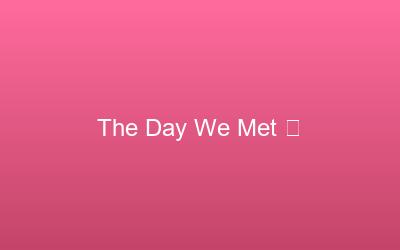

# CUSTOMIZATION QUICK LINKS

## 📝 All locations where you need to make changes:

### 1. HERO SECTION (index.html)
**Lines 55-60** - Edit your greeting
```
Line 55: <h1 class="hero-title">Hey love…</h1>
Line 56: <p class="hero-subtitle">this page exists because of you ❤️</p>
Line 57: <p class="hero-description">Scroll down and relive our story</p>
Line 59: <button class="btn-primary" id="startBtn">Start Our Story</button>
```

### 2. TIMELINE SECTION (index.html)

**TIMELINE ITEM 1** (Lines 75-88)
```
Line 80: <span class="timeline-date">Month Year</span>
Line 81: <h3 class="timeline-title">The Day We Met 💫</h3>
Line 82: <p class="timeline-text">Your story here...</p>
Line 77: 
```

**TIMELINE ITEM 2** (Lines 90-103)
```
Line 95: <span class="timeline-date">Month Year</span>
Line 96: <h3 class="timeline-title">Our First Date ☕</h3>
Line 97: <p class="timeline-text">Your story here...</p>
Line 92: 
```

**TIMELINE ITEM 3** (Lines 105-118)
```
Line 110: <span class="timeline-date">Month Year</span>
Line 111: <h3 class="timeline-title">That One Crazy Memory 😂</h3>
Line 112: <p class="timeline-text">Your story here...</p>
Line 107: 
```

**TIMELINE ITEM 4** (Lines 120-133)
```
Line 125: <span class="timeline-date">Month Year</span>
Line 126: <h3 class="timeline-title">When I Knew It Was You 🥹</h3>
Line 127: <p class="timeline-text">Your story here...</p>
Line 122: 
```

### 3. WHY I LOVE YOU SECTION (index.html)

**REASON 1** (Line 141)
```html
<p class="reason-text">Your custom reason here</p>
```

**REASON 2** (Line 149)
```html
<p class="reason-text">Your custom reason here</p>
```

**REASON 3** (Line 157)
```html
<p class="reason-text">Your custom reason here</p>
```

**REASON 4** (Line 165)
```html
<p class="reason-text">Your custom reason here</p>
```

**REASON 5** (Line 173)
```html
<p class="reason-text">Your custom reason here</p>
```

**REASON 6** (Line 181)
```html
<p class="reason-text">Your custom reason here</p>
```

### 4. SLIDESHOW SECTION (index.html)

**SLIDE 1** (Lines 190-193)
```html

<p class="slide-caption">Your caption here</p>
```

**SLIDE 2** (Lines 195-198)
```html

<p class="slide-caption">Your caption here</p>
```

**SLIDE 3** (Lines 200-203)
```html

<p class="slide-caption">Your caption here</p>
```

**SLIDE 4** (Lines 205-208)
```html

<p class="slide-caption">Your caption here</p>
```

### 5. SURPRISE SECTION (index.html)

**Lines 230-236** - Edit the surprise message
```html
Line 232: <h2 class="message-title">Will you be my Valentine—</h2>
Line 233: <p class="message-text">today, tomorrow, always? ❤️</p>
Line 239: <h2>I knew you'd say yes 💕</h2>
Line 240: <p>Your custom message here</p>
```

### 6. FOOTER SECTION (index.html)

**Lines 256-258** - Edit footer
```html
Line 256: <p class="footer-quote">"Your romantic quote" ❤️</p>
Line 257: <p class="footer-credit">Made with love by Your Name</p>
```

### 7. COLORS (styles.css)

**Lines 6-12** - Edit color palette
```css
Line 6:  --color-primary: #ff6b9d;        /* Main pink */
Line 7:  --color-secondary: #c44569;      /* Rose red */
Line 8:  --color-accent: #ffeef8;         /* Blush pink */
Line 9:  --color-cream: #fffbf7;          /* Soft cream */
Line 10: --color-white: #ffffff;          /* White */
```

### 8. FONTS (index.html & styles.css)

**index.html Line 9** - Add Google Fonts link

**styles.css Lines 15-17** - Update font families
```css
Line 15: --font-heading: 'Great Vibes', cursive;
Line 16: --font-title: 'Playfair Display', serif;
Line 17: --font-body: 'Montserrat', sans-serif;
```

### 9. MUSIC (assets/music/)

Save your romantic song here:
```
assets/music/romantic-song.mp3
```

Make sure it's named exactly `romantic-song.mp3` (lowercase)

---

## 📊 SUMMARY OF EDITS:

| Section | File | Lines | What to Edit |
|---------|------|-------|------------|
| Hero | index.html | 55-60 | Greeting message |
| Timeline 1 | index.html | 75-88 | Date, title, story, image |
| Timeline 2 | index.html | 90-103 | Date, title, story, image |
| Timeline 3 | index.html | 105-118 | Date, title, story, image |
| Timeline 4 | index.html | 120-133 | Date, title, story, image |
| Reasons (6x) | index.html | 141-181 | Six custom reasons |
| Photos (4x) | index.html | 190-208 | Captions & image paths |
| Surprise | index.html | 230-240 | Message & final text |
| Footer | index.html | 256-258 | Quote & name |
| Colors | styles.css | 6-12 | Color values |
| Fonts | index.html & styles.css | Various | Font choices |
| Music | assets/music/ | - | Add romantic-song.mp3 |

---

## ✨ EASY EDITING TIPS:

1. Use a good text editor: VS Code, Notepad++, or Sublime Text
2. Use Find & Replace (Ctrl+H) to change things globally
3. Keep a backup of original files
4. Test after each major edit
5. Check line numbers match (they might shift if you add/remove lines)

---

## 🎨 RECOMMENDED EDITS ORDER:

1. Hero section (make it personal)
2. Timeline events (tell your stories)
3. Why I love you reasons
4. Replace images
5. Update slideshow captions
6. Customize surprise message
7. Update footer with your name
8. (Optional) Change colors
9. (Optional) Add background music
10. Test everything!

---

Good luck! You've got this! 💕
